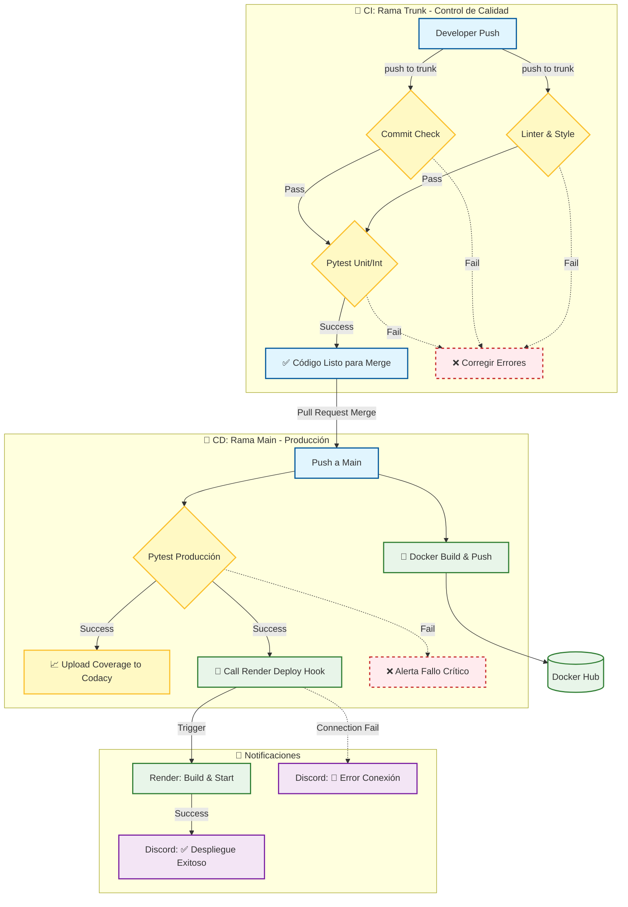

# 🔄 Guía de Integración y Despliegue Continuo (CI/CD)

Este documento describe la arquitectura de automatización implementada en **Formula Hub** utilizando GitHub Actions. Nuestro pipeline asegura que cada cambio en el código sea verificado, probado y desplegado de manera segura y eficiente.

---

## 🛠️ Resumen del Pipeline

El ciclo de vida del código pasa por las siguientes etapas automatizadas:

| Etapa | Workflow | Disparador | Función Principal |
| :--- | :--- | :--- | :--- |
| **1. Calidad** | `CI_commits.yml` | Push (trunk) | Valida el formato de los mensajes de commit. |
| **2. Estilo** | `CI_lint.yml` | Push (trunk) | Verifica PEP 8 (flake8), formato (black) y orden de imports (isort). |
| **3. Tests** | `CI_pytest.yml` | Push (trunk, main) | Ejecuta tests unitarios/integración en Python 3.10, 3.11 y 3.12. |
| **4. Análisis** | `CI_codacy.yml` | Tras Pytest (éxito) | Sube el reporte de cobertura de código a Codacy. |
| **5. Build** | `CD_dockerhub.yml` | Push (main) | Construye la imagen Docker y la sube a Docker Hub. |
| **6. Deploy** | `CD_webhook.yml` | Tras Pytest (éxito) | Despliega la nueva versión en Render y notifica a Discord. |

---

## 🔍 Detalle de los Workflows

### 1. Verificación de Commits (`CI_commit.yml`)
Garantiza que el historial del proyecto sea limpio y legible siguiendo el estándar **Conventional Commits**.
- **Herramienta:** `webiny/action-conventional-commits`.
- **Regla:** Los mensajes deben seguir el formato `tipo: descripción` (ej. `feat: add login`).

### 2. Análisis Estático (`CI_lint.yml`)
Asegura la calidad y consistencia del código Python sin ejecutarlo.
- **Matriz:** Se ejecuta en Python 3.10, 3.11 y 3.12 para garantizar compatibilidad.
- **Herramientas:**
    - `flake8`: Busca errores de sintaxis y estilo.
    - `black`: Verifica que el código esté formateado correctamente (`--check`).
    - `isort`: Verifica que las importaciones estén ordenadas alfabéticamente.

### 3. Pruebas Automatizadas (`CI_pytest.yml`)
El núcleo de la Integración Continua. Ejecuta la suite de pruebas completa.
- **Entorno:** Levanta un contenedor de servicio **MariaDB** temporal para pruebas de integración reales.
- **Acciones:**
    1. Instala dependencias.
    2. Ejecuta `pytest` con cobertura de código (`pytest-cov`).
    3. Genera un archivo `coverage.xml`.
    4. Sube el reporte como un **artefacto** de GitHub para ser usado por otros workflows.

### 4. Cobertura de Código (`CI_codacy.yml`)
Workflow dependiente (`workflow_run`) que se ejecuta **solo si Pytest termina con éxito**.
- **Objetivo:** Enviar métricas de calidad a Codacy.
- **Proceso:**
    1. Descarga el artefacto `coverage-report` generado por el workflow anterior.
    2. Lo sube a Codacy usando el `CODACY_API_TOKEN`.

---

## 🚀 Despliegue Continuo (CD)

El despliegue solo ocurre cuando se hacen cambios en la rama **`main`** y los tests han pasado.

### 5. Docker Build & Push (`CD_dockerhub.yml`)
Construye la imagen de la aplicación para producción.
- **Registro:** Docker Hub.
- **Tags generados:**
    - `:latest` (La versión actual en producción).
    - `:<commit-sha>` (Versión inmutable para trazabilidad).
- **Seguridad:** Usa `DOCKER_USER` y `DOCKER_TOKEN` almacenados en GitHub Secrets.

### 6. Despliegue en Render (`CD_webhook.yml`)
Orquesta la actualización del servidor en vivo.
- **Activación:** Se dispara automáticamente tras el éxito de `Pytest` en la rama `main`.
- **Mecanismo:** Llama al **Deploy Hook** de Render (URL secreta) para forzar una reconstrucción.
- **Notificaciones:**
    - ✅ **Éxito:** Envía un mensaje a Discord confirmando el despliegue.
    - 🚨 **Fallo:** Envía una alerta a Discord si no se pudo contactar con Render.

---

## 🔐 Gestión de Secretos

Para que este pipeline funcione, el repositorio debe tener configurados los siguientes **GitHub Secrets**:

| Secreto | Descripción | Usado en |
| :--- | :--- | :--- |
| `DOCKER_USER` | Usuario de Docker Hub. | `CD_dockerhub` |
| `DOCKER_TOKEN` | Token de acceso (Access Token) de Docker Hub. | `CD_dockerhub` |
| `CODACY_API_TOKEN` | Token de proyecto para subir cobertura. | `CI_codacy` |
| `WEBHOOK_DOMAIN` | URL del Deploy Hook de Render (sin `https://`). | `CD_webhook` |
| `DISCORD_WEBHOOK_URL` | URL del Webhook del canal de Discord. | `CD_webhook` |

---

## 📊 Diagrama de Flujo del Pipeline (CI/CD)

Este diagrama ilustra cómo fluye el código desde el desarrollo hasta la producción, diferenciando las responsabilidades de cada rama.

---

## 🧠 Explicación del Flujo

El pipeline se divide en dos carriles principales según la rama en la que trabajes:

#### 1\. 🔄 Fase de Integración Continua (CI) - Rama `trunk`

Esta fase ocurre **mientras desarrollas**. Su objetivo es asegurar que el código nuevo no rompa nada antes de juntarlo con el código principal.

  * **Disparador:** Cada vez que haces `git push` a la rama `trunk`.
  * **Acciones:**
    1.  Valida que tus mensajes de commit sigan el estándar.
    2.  Revisa el estilo del código (Black, Flake8, Isort).
    3.  Ejecuta los tests en una base de datos temporal.
  * **Resultado:** Si algo falla, **no** debes hacer merge a `main`.

#### 2\. 🚀 Fase de Despliegue Continuo (CD) - Rama `main`

Esta fase ocurre **cuando aceptas el Pull Request**. Su objetivo es llevar el código aprobado a producción.

  * **Disparador:** Cuando el código llega a `main`.
  * **Acciones Paralelas:**
      * **Docker:** Construye la imagen final y la sube a Docker Hub para que cualquiera pueda descargarla.
      * **Pytest:** Ejecuta los tests una última vez por seguridad.
  * **Acciones Secuenciales (Solo si Pytest aprueba):**
      * **Codacy:** Sube el reporte de calidad.
      * **Render:** Se activa el webhook para actualizar el servidor real.
      * **Discord:** Te avisa al móvil de que la nueva versión ya está online.
